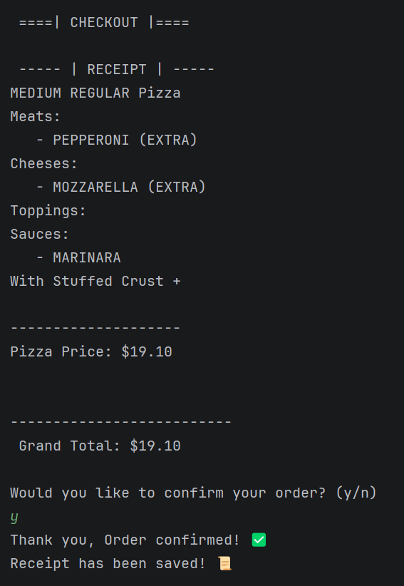

# 🍕 PIZZA-licious 🍕

## Project Overview
PIZZA-Licious is my second capstone project. It's a POS (Point Of Sales) application! Specifically based on a pizza shop.

# Features ⚙️
This app includes:
**1. Home Screen**
- that lets the user create a new Order or Exit the application
**2. Order Screen**
- Add an Item
- Checkout
- or cancel your order and go back to the Home Screen
**3. Add Item Screen**
- Customize a Pizza (Size, Crust Type, If you want Stuffed Crust, Toppings/Meats/Cheese/Sauces/Meats)
- Adding a Drink (Size and choosing your own flavor)
- Add Garlic Knots
**4. Checkout Screen**
- Confirm your order (Creates a receipt and goes back to Home Screen)
- Cancel (Deletes Order and goes back to Home Screen)

# 💲Pricing Table 💲 
Depending on the toppings and size will vary in price

---

## Pizza Base Prices 💲

| Size | Price |
|---|---|
| Small | $8.50 |
| Medium | $12.00 |
| Large | $16.50 |

## Meat Topping Prices 💲

| Size | Regular | Extra |
|---|---|---|
| Small | $1.00 | $0.50 |
| Medium | $2.00 | $1.00 |
| Large | $3.00 | $1.50 |

## Cheese Topping Prices 💲

| Size | Regular | Extra |
|---|---|---|
| Small | $0.75 | $0.30 |
| Medium | $1.50 | $0.60 |
| Large | $2.25 | $0.90 |

## Stuffed Crust 💲

| Option | Price |
|---|---|
| Stuffed Crust | +$2.00 |


## Drink Prices 💲

| Size | Price |
|---|---|
| Small | $2.00 |
| Medium | $2.50 |
| Large | $3.00 |


## Side Prices 💲

| Item | Price |
|---|---|
| Garlic Knots | $1.50 |

---

The application demonstrates object-oriented programming concepts including:

- Classes and objects
- Interfaces
- Enums
- Encapsulation
```java
public class Pizza {

    private PizzaSize size;

    private CrustType crustType;

    private boolean stuffedCrust;

}
```

- Polymorphism
```java
ArrayList<OrderItem> items =
        new ArrayList<>();

items.add(new Pizza());
items.add(new Drink());
items.add(new GarlicKnots());
```

- Generics
- File I/O
- UML design

---

# 🏗️ Project Structure

```text
PIZZA-licious/
│
├── .idea/
│
├── .mvn/
│
├── diagrams/
│   ├── PIZZALicious.drawio
│   └── PIZZALicious.drawio.png
│
├── receipts/
│   ├── 20260527-215533.txt
│   ├── 20260527-215723.txt
│   ├── 20260527-215826.txt
│   ├── 20260527-215955.txt
│   ├── 20260527-220126.txt
│   └── 20260528-112843.txt
│
├── src/
│   └── main/
│       └── java/
│           └── com.pluralsight/
│
│               ├── Main.java
│               │
│               ├── enums/
│               │   ├── Cheese.java
│               │   ├── CrustType.java
│               │   ├── DrinkSize.java
│               │   ├── Meat.java
│               │   ├── PizzaSize.java
│               │   ├── RegularTopping.java
│               │   └── Sauce.java
│               │
│               ├── interfaces/
│               │   └── OrderItem.java
│               │
│               ├── models/
│               │   ├── Drink.java
│               │   ├── GarlicKnots.java
│               │   ├── Order.java
│               │   ├── Pizza.java
│               │   └── PizzaTopping.java
│               │
│               ├── screens/
│               │   ├── AddItemScreen.java
│               │   ├── CheckoutScreen.java
│               │   ├── HomeScreen.java
│               │   └── OrderScreen.java
│               │
│               ├── service/
│               │   └── ReceiptWriter.java
│               │
│               └── utils/
│                   └── InputHelper.java
│
├── pom.xml
│
└── README.md
```
---

## UML Diagram
Located in: /diagrams/PIZZALicious.drawio.png
Editable draw.io file: /diagrams/PIZZALicious.drawio

---
# Screenshot Example


---

# Tech Used 💻
- Java / Maven
- IntelliJ IDEA
- Draw.io
- File I/O

---

# ▶️ How to Run
1. Open in IntelliJ
2. Navigate to Main.java
3. Run with the green arrow at the top in the middle!

---

## 💭 What I learned
- I learned how to use enums, interfaces, and further work with File I/O
- How to create a Diagram with Drawio
- Improve on the skills I already know! 🥳

---

## What I could expand upon... ✍️
- I would of loved to have used more of the branches, I was so used to working on main that I didn't really incorporate it in this project
- Of course, I look forward to updating this in the future!
